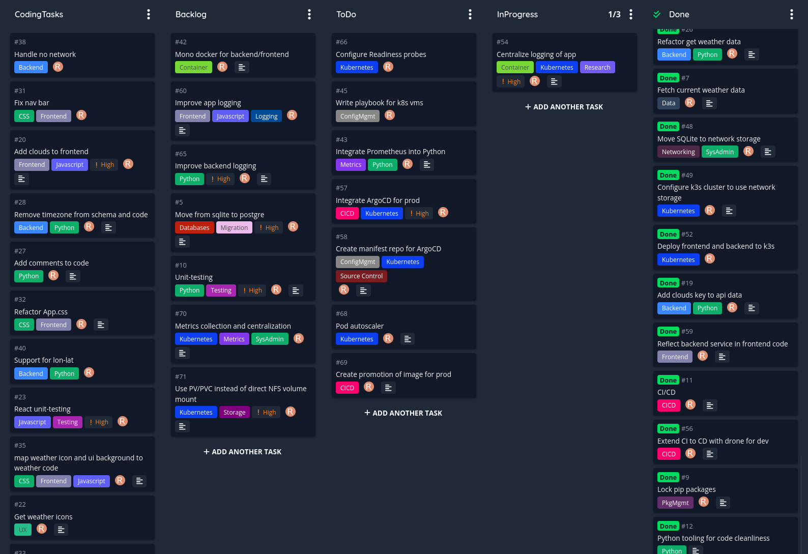
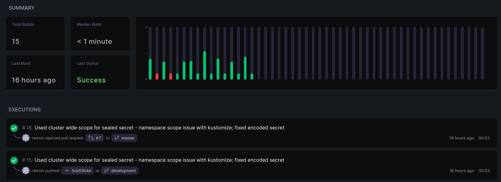
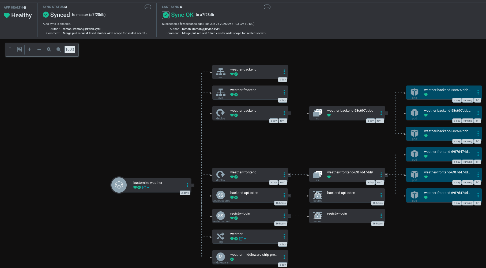
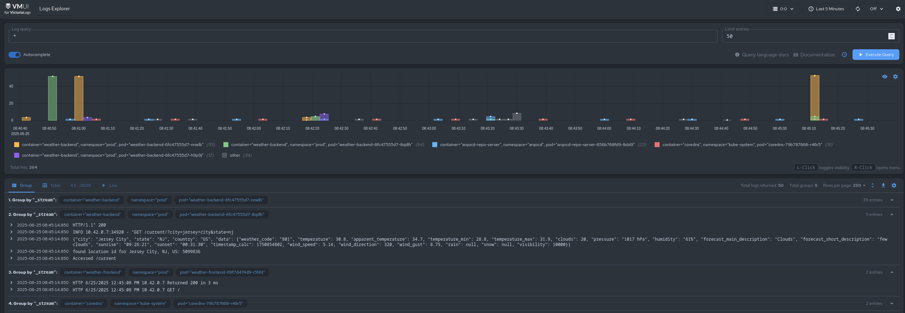
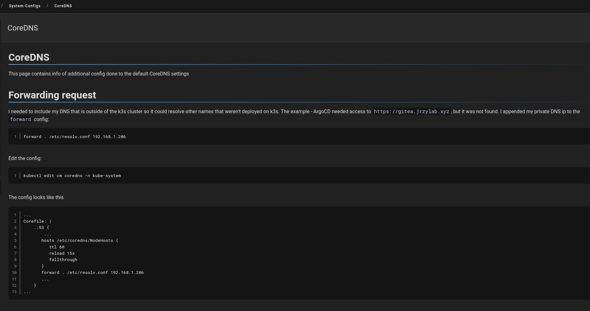

# Project
This project sole purpose is to refresh my knowledge and understanding of the various technologies and concepts that were part of my work as a devops engineer. I've created an app, but the app was just a means to developing the infrastructure around it - I'm not a software engineer by trade. I started from what I knew, and then researching what was possible outside of what I knew and learned.

Some of the tech choices were are out of my own interest but never was able to use them professionally, CNCF, or just reading recommendations by users online. Most important factors for implementiion: 1) is it simple to use and get started and 2) is it resource efficient (due to my sever capacity)

Some of the choices in this project may not make sense at a glance. For example, my Terraform and CDK code basically do the same thing.

### Agile
The idea was to just get started and not over-think the project. I made the effort to break down all ideas into workable pieces and to start simple. I could refactor or optimize later, but mort importantly, I had to get started. I had [Vikunja](https://vikunja.io/) already in my homelab, so I just created a new Kanban project there to manage tasks

### Backend

##### Database
SQLite requires basically nothing to get started. I had initially considered to move to PostGres after the project gets going, but I decided to stay with it. It is currently mounted via PV/NFS, and but have not tested for performance and itegreity.

##### API
[FastAPI](https://fastapi.tiangolo.com/)

### Frontend
ReactJS was my choice simply becaues i've used it in the past and didn't want to spend much time researching frontend as it's not something I do professionally, although I have for a tiny project

### Networking
My entire project is on my home network, unsegmented. I limited the DHCP assignment on my router, and set aside a small block of ip's for my LoadBalancer. I use [Pihole](https://https://pi-hole.net/) as my main DNS, and [NPM](https://nginxproxymanager.com/) to terminate all my entry points; Both were already in my homelab

##### LoadBalancer
K3s has a default load-balancer called ServiceLB, but I could not manage to get it to work. I disabled it and installed [MetalLB](https://metallb.io/).

### Orchestrator
##### K3S
[k3s](https://k3s.io/) is said to be designed for resource-constrained env. Super simple to get up and running. A plus was that Traefik is used by default, which I leverage with minimal extra config. All traffic passed through Traefik routes to either backend or frontend, alleviating CORS issues. This was a problem I had to solve as I was developing locally initially.

### CI/CD
#### Repo
[Gitea](https://about.gitea.com/) is my source repo and I use the built-in package manager as my image repo. I am also using github as a remote for this project as I needed to have this project publicly avail; so i push to both repos the exact same commits. Internal source repo was necessary so that I could run CI which was necessary for my CD

#### DroneCI
[DroneCI](https://www.drone.io/) is very light and very simple to config. There are two pipelines, dev and prod

##### Dev
Dev runs on every push. This pipeline runs static anaylsis, unit-test, build images, pushes them, and deploys using `kubectl rollout ...`. You can see more details in `.drone.yml`. 'dev' is appended to images.

##### Prod
The prod pipeline run on a PR from dev into master. This pipeline simply re-tags the most recent dev images to differentiate between dev and prod - 'dev' is removed. Semantic versioning is used.

#### ArgoCD
[Argo](https://argo-cd.readthedocs.io/en/stable/) deploys to the prod namespace/env in conjunction with [kustomize](https://kustomize.io/). I'm using Argo's default rollout strategy

##### Prod

### Observability

#### Logs
Using [VictoriaLogs](https://docs.victoriametrics.com/victorialogs/) as it is much more efficient for RAM and storage. Quite easy to setup, using [Vector](https://vector.dev/) to collect and do some minor transformations. Vector is collecting pod logs and some system logs. I still need to work on improving the logs I generate with the app

#### Metrics
<\WIP>

#### Alerting
<\WIP>

### Security

#### Secrets

Drone has it's own secret management that I use for injecting creds for accessing Gitea

[SealedSecrets](https://github.com/bitnami-labs/sealed-secrets) is used to encrypt Secret k8s resource. I seal the docker login to fetch images, and the API token used by the backend. This allows me to store the secrets.yaml in my repo. This approach provided security without much complexity. As I moved to GitOps, I wanted to store all my k8s manifest in git once I moved to GitOps

#### TLS
I have a real domain and LetsEncrypt autorenews my cert from my registrar NameCheap. But I have not yet set up TLS between internal services

#### SSO
I think all of my apps are using created username/password, but I would like to move to SSO. This is another backlog item

### Documentation
A lot of information and extra config was learned and needed to get all the moving parts of the project working. I was already hosting [WikiJS](https://js.wiki/), so I used it to document some of the difficulties I came across throughout this project. Example:

### ConfigMgmt

##### Ansible
I am a big fan of [Ansible](https://docs.ansible.com/ansible/latest/index.html). I had a small opportunity to setup k3s cluster nodes

##### Terraform
I am an even bigger fan of [Terraform](https://developer.hashicorp.com/terraform). I've used it for deploying infrastructure on AWS

##### AWS CDK
CDK was used exetensibly at my previous work, so I just wanted to refresh.

### Notes
This project has a lot of moving pieces. And it keeps on growing and getting more complex. Slowly starting to feel like a lot for one person! So I left some pieces unfinished as I need to get this repo out as a ref on my resume. But the app is fully functional on my 'on-prem' deployment. Still working on converting it to cloud, which will require some changes that may break or split the codebase for cloud or on-prem deployment. I'm avoiding this for now and focusing on continuing development for 'on-prem'